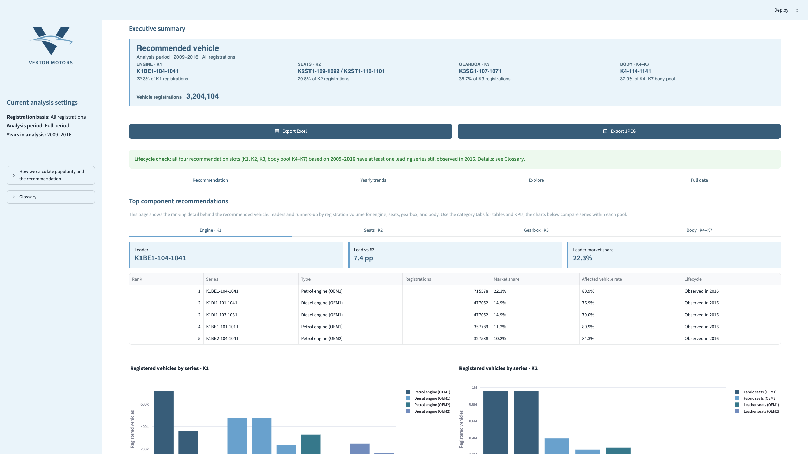
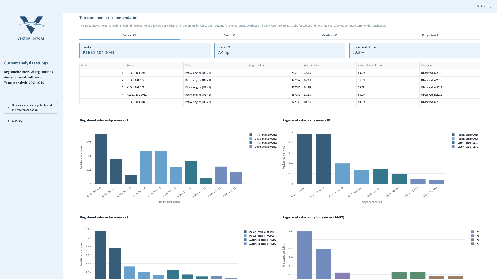
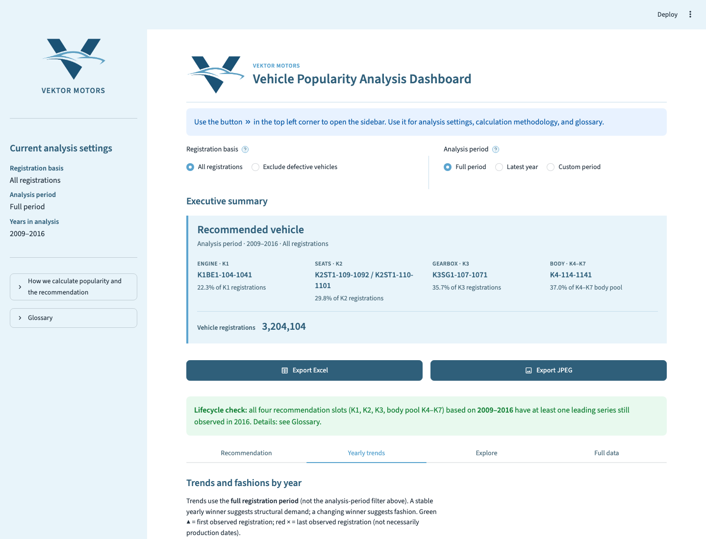
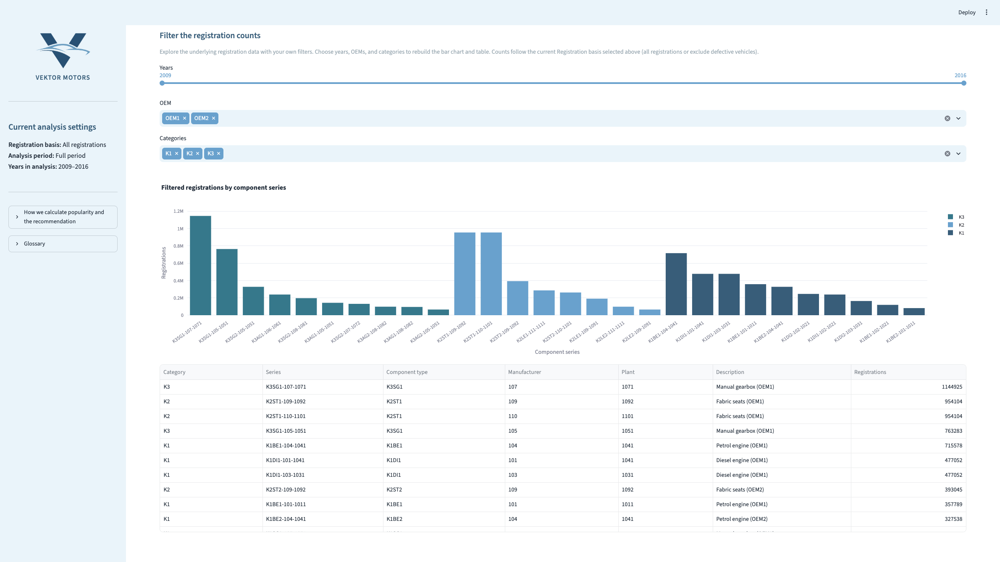
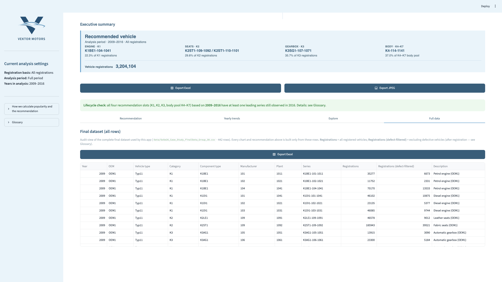

# Vehicle Popularity Analysis Dashboard — User Guide

**Group 38 · Vektor Motors · SoSe 2026**

This guide explains how to run and use the Streamlit app  
`SoSe26_Case_Study_App_Group_38.py`. Screenshots for each main view are in this
folder (`01`–`05_*.png`).

---

## 1. Start the app

From the submission folder `SoSe26_Case_Study_Group_38/`:

```bash
python3 -m venv .venv
source .venv/bin/activate          # Windows: .venv\Scripts\activate
pip install -r Additional_files/requirements.txt
streamlit run SoSe26_Case_Study_App_Group_38.py --server.fileWatcherType none
```

The app needs **only** one data file:

`Data/SoSe26_Case_Study_finalData_Group_38.csv`

No tubCloud originals are required to run the dashboard.

---

## 2. Layout at a glance

| Area | Purpose |
|------|---------|
| **Sidebar** | Branding, current filter summary, methodology, glossary |
| **Top filters** | Registration basis + analysis period (side by side) |
| **Executive summary** | Recommended vehicle card, exports, lifecycle check |
| **Tabs** | Recommendation · Yearly trends · Explore · Full data |

Open the sidebar with the **»** control (top left) to change settings and read
the methodology.

---

## 3. Global filters (main page)

### Registration basis

| Option | Meaning |
|--------|---------|
| **All registrations** | Count every registered vehicle (`n_registrations`) |
| **Exclude defective vehicles** | Remove vehicles defective **after** registration (`n_registrations_clean`) |

### Analysis period

| Option | Meaning |
|--------|---------|
| **Full period** | All years in the dataset (2009–2016) |
| **Latest year** | Only the most recent year |
| **Custom period** | Choose start and end year |

These filters affect the **recommended vehicle**, ranking tables, and Explore
tab. **Yearly trends** always uses the full period so long-term fashions stay
visible.

---

## 4. Executive summary — key KPIs



### Recommended vehicle card

Four independent slots (not seven separate body winners):

| Slot | Pool | Example leader |
|------|------|----------------|
| Engine · K1 | Highest volume within K1 | K1BE1-104-1041 |
| Seats · K2 | Highest volume within K2 | K2ST1-109-1092 / K2ST1-110-1101 (tie) |
| Gearbox · K3 | Highest volume within K3 | K3SG1-107-1071 |
| Body · K4–K7 | Highest volume across **all** body series | K4-114-1141 |

Under each series you see its **share within the pool** (e.g. 22.3% of K1
registrations).

### Vehicle registrations

Total registered vehicles in the current filter mode. For K1 this equals the
number of vehicles counted in the analysis (one engine per vehicle).

### Lifecycle check (green banner)

For each of the four slots, confirms whether at least one leading series from
the selected period still has registrations in **2016** (latest data year).
See **Glossary** in the sidebar for details.

### Export buttons

| Button | Output |
|--------|--------|
| **Export Excel** | Table of recommended slots, shares, period, basis, registrations |
| **Export JPEG** | Image of the recommended vehicle card (for slides/reports) |

---

## 5. Tab: Recommendation



Ranking detail behind the executive summary.

**Category sub-tabs:** Engine · K1 | Seats · K2 | Gearbox · K3 | Body · K4–K7

**KPIs per category**

| KPI | Meaning |
|-----|---------|
| **Leader** | Top series by registration volume in the pool |
| **Lead vs #2** | Gap to second place (percentage points) |
| **Leader market share** | Leader’s share within the category (or body pool) |

**Table columns**

| Column | Meaning |
|--------|---------|
| Rank | Position; tied leaders share the same rank |
| Series | Component series ID (type–manufacturer–plant) |
| Type | Human-readable label (e.g. Petrol engine OEM1) |
| Registrations | Count in current filter mode |
| Market share | Share within the category |
| Affected vehicle rate | Share of that series’ registrations linked to defective vehicles |
| Lifecycle | Whether the series is still observed in 2016 |

Bar charts below compare series within each pool.

---

## 6. Tab: Yearly trends



Shows **fashions over time** using the **full** dataset period (ignores the
analysis-period filter above).

| Control | Options |
|---------|---------|
| **Display metric** | Registration volume · Category market share |
| **Category** | K1–K7 |

**Chart markers**

| Marker | Meaning |
|--------|---------|
| Green ▲ | First year the series appears (after 2009) |
| Red × | Last year the series appears (before 2016) |

A stable yearly leader suggests structural demand; changing winners suggest
fashion.

---

## 7. Tab: Explore



Interactive slice of the final dataset.

| Filter | Effect |
|--------|--------|
| **Years** | Range slider |
| **OEM** | OEM1 / OEM2 |
| **Categories** | K1–K7 multi-select |

Builds a bar chart and table for the filtered rows. Counts follow the current
**Registration basis** (all vs defect-filtered).

---

## 8. Tab: Full data



Audit view of all **442 rows** in `SoSe26_Case_Study_finalData_Group_38.csv`.
Every chart and recommendation is derived from this table only.

| Column | Meaning |
|--------|---------|
| `n_registrations` | All registered vehicles |
| `n_registrations_clean` | Excluding defective vehicles (after registration) |

**Export Excel** downloads the full displayed table.

---

## 9. Sidebar reference

### Current analysis settings

Live summary of registration basis, period mode, and years in scope.

### How we calculate popularity and the recommendation

Business rules: four pools, body ranking across K4–K7, ties, and trends
behaviour.

### Glossary

Definitions for series, registration volume, defective vehicle, lifecycle check,
and exports.

---

## 10. What the app does not do

- Does not load tubCloud raw files — only the final CSV.
- Defect logic is documented in the Case Study notebook; the app consumes the
  precomputed `n_registrations_clean` column.

---

## 11. Files in this folder

| File | Content |
|------|---------|
| `01_executive_summary.png` | Recommended vehicle + exports |
| `02_recommendation_tab.png` | Rankings, KPIs, category charts |
| `03_yearly_trends.png` | Yearly fashions |
| `04_explore_tab.png` | Custom filters |
| `05_full_data_tab.png` | Full dataset table |
| `Dashboard_User_Guide.md` | This document |

---

*Participants: Mark Prymak, Pascal Diekmeier, Smilla Elisa Eichhorn, Willi Leonard Horn*
